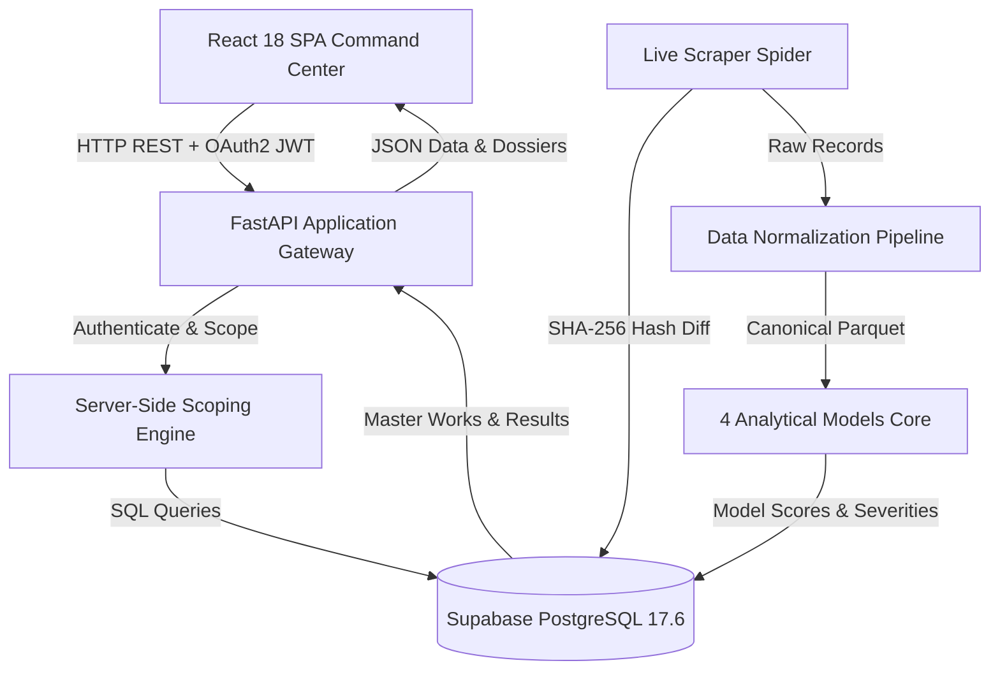
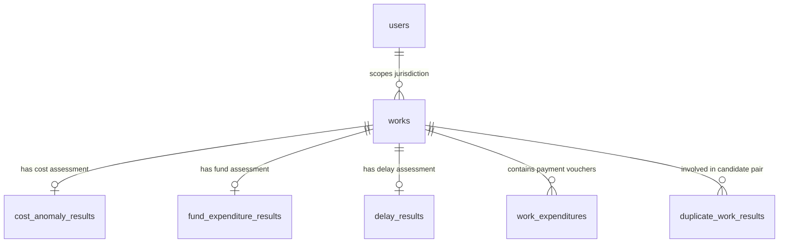

# 16. Master Mermaid Architecture Diagrams

## System Architecture & Data Flow Mermaid Diagrams

### 1. High-Level System Architecture

```mermaid
flowchart TD
    CLIENT[React 18 SPA Command Center] -->|HTTP REST + OAuth2 JWT| API[FastAPI Application Gateway]
    API -->|Authenticate & Scope| RBAC[Server-Side Scoping Engine]
    RBAC -->|SQL Queries| DB[(Supabase PostgreSQL 17.6)]
    DB -->|Master Works & Results| API
    API -->|JSON Data & Dossiers| CLIENT
    
    SCRAPER[Live Scraper Spider] -->|SHA-256 Hash Diff| DB
    SCRAPER -->|Raw Records| PIPE[Data Normalization Pipeline]
    PIPE -->|Canonical Parquet| ML[4 Analytical Models Core]
    ML -->|Model Scores & Severities| DB
```

### 2. Database ER Diagram

```mermaid
erDiagram
    works ||--o| cost_anomaly_results : "has cost assessment"
    works ||--o| fund_expenditure_results : "has fund assessment"
    works ||--o| delay_results : "has delay assessment"
    works ||--o{ work_expenditures : "contains payment vouchers"
    works ||--o{ duplicate_work_results : "involved in candidate pair"
    users ||--o{ works : "scopes jurisdiction"
```

